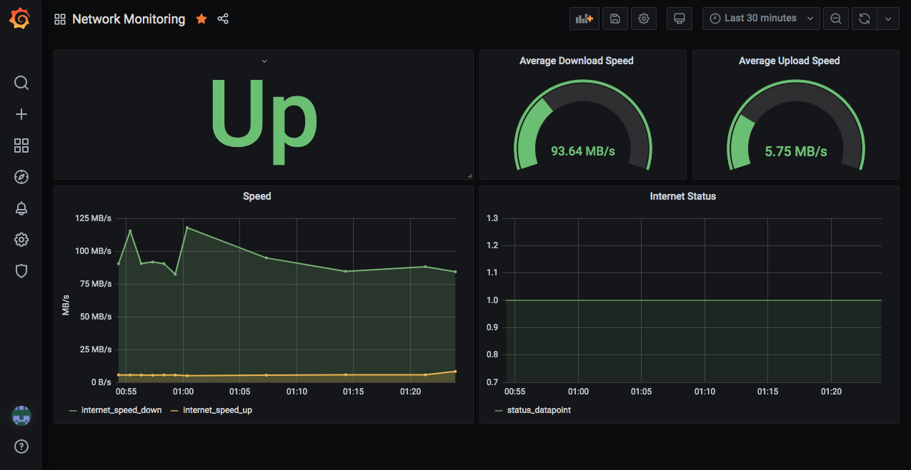

## Description
Some services to run on a cron and track basic network perf over time. 
I'm convinced that comcast throttles me during the day but I don't have the data to back
it up yet

The setup is pretty basic, a python script pushes metrics to influxdb, and granfa 
visualizes it



## Development
```
python3 -m venv ./env
source ./env/bin/activate
pip install -r requirements.txt
cd src
python3 main.py
```

## Deployment
```
rsync --filter=':- .gitignore' $PWD/ some-host:/opt/speedometer/ -r --delete

# execute the rest of this on the target host
ssh some-host
cd /opt/speedometer
docker-compose -f docker/docker-compose.yml build collector 
docker-compose up -d
```

Create a script to wrap the collector runs with some logs
```
#!/usr/bin/env bash

echo "$(date): Running collector" >> ./collector.log
/usr/local/bin/docker-compose -f /opt/speedometer/docker/docker-compose.yml up collector
echo "$(date): Done running collector" >> ./collector.log
```

```
# create a cronjob to run the collector at some interval
*/7 * * * * /root/run-collector.sh
```

## Appendix
Example speedtest cli out json:
```json
{
    "type":"result",
    "timestamp":"2010-09-28T01:17:20Z",
    "ping": {
        "jitter": 5.5609999999999999,
        "latency": 18.079999999999998
    },
    "download": {
        "bandwidth": 5429538,
        "bytes": 64531544,
        "elapsed": 13517
    },
    "upload": {
        "bandwidth": 625648,
        "bytes": 6727972,
        "elapsed": 12316
    },
    "packetLoss":0,
    "isp":"ISP",
    "interface": {
        "internalIp": "10.10.10.10",
        "name":"eth0",
        "macAddr":"00:00:00:00:00:00",
        "isVpn":false,
        "externalIp":"8.8.8.8"
    },
    "server":{
        "id": 1,
        "name": "Foo Bar",
        "location": "Foo, BA",
        "country": "Discworld",
        "host":"sp1.acel.la",
        "port": 443,
        "ip":"8.8.8.8"
    },
    "result": {
        "id":"id",
        "url":"https://www.speedtest.net/result/c/id"
    }
}
```
